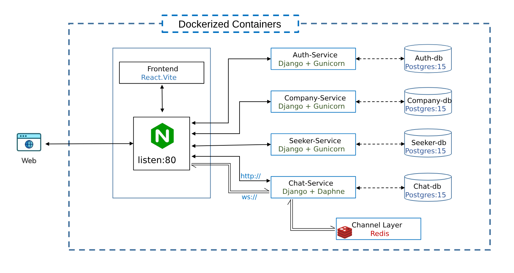

#  Jobify Microservices Application 

A scalable, microservices-based Job Portal system where job seekers can connect with companies, apply for jobs, and chat in real-time — all backed by secure JWT authentication and isolated service databases.

📎[Monolithic version](https://github.com/sravan-kumar-ta/Multi-Container-Django-React-Application)
---

## 🏗 Architecture

This system follows a true microservice architecture. Each service has its own codebase, database, and responsibility.

---

### 🌐 Key Features
- 🧑‍💼 User registration and JWT authentication
- 💼 Job creation, listing, and management by companies
- 🔍 Job search and profile management by seekers
- 💬 Private one-to-one real-time chat between users (WebSocket)
- ⚙️ Completely containerized architecture with isolated databases per service
- 📁 Static and media files served via NGINX proxy

## Contributors 🤝

Feel free to open issues or pull requests to contribute to this project!😊

-----